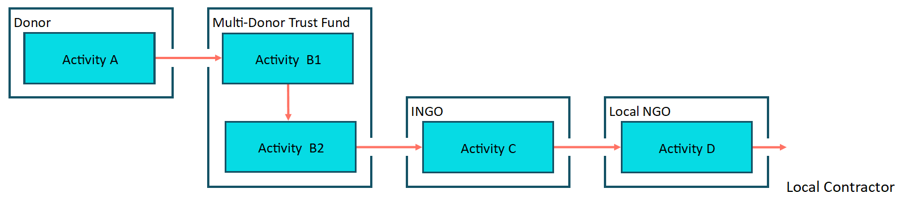
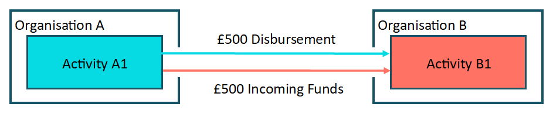

IATI traceability guidance
==========================

The inclusion of specific data within IATI activities allows users to trace the flow of funds from the original donors down to the intended beneficiaries. Delivery chains can be long and complex. For example:

  *Several donors might contribute to a multi-donor trust fund, which contracts a series of international NGOs, who in turn use local NGO partners, who then hire local contractors to deliver services.*

Each organisation needs to publish to IATI and link their data with their partners. Publishers should include who they are giving funding to, and who they are receiving funding from. They should also include references to the related activities their partners have published. As each activity has a unique IATI Activity Identifier, this identifier can be referenced by partner organisations.
   
When all publishers include the unique IATI Activity Identifier in their publishing, data users can identify the related activities, find partners working on the same activity and track the flow of funds both up and down the delivery chain. This is traceability. For example:

  *If Organisation A gives Organisation B £500 as part of their activity A1, Organisation B should publish a receipt of the £500 from Organisation A. Organisation B should include a reference to activity A1, showing the activity their funding came from. This allows data users to track the flow of funds through the delivery chain.*

Achieving traceability across all IATI data requires every publisher to include data on the organisation(s) and activity(s) from which their funding is coming from and, where possible, going to.

Types of identifiers
--------------------

Each organisation publishing to IATI will have:

- `IATI Organisation Identifier <https://iatistandard.org/en/guidance/publishing-data/registering-and-managing-your-organisation-account/how-to-create-your-iati-organisation-identifier/>`__
  
  This is a unique identifier for their organisation e.g. `XM-DAC-41114 <http://d-portal.org/ctrack.html?reporting_ref=XM-DAC-41114#view=main/>`__ for the United Nations Development Programme (UNDP). View the list of all IATI Organisation Identifiers `here <https://www.iatiregistry.org/publisher>`__

- `IATI Activity Identifier <https://iatistandard.org/en/guidance/standard-overview/preparing-your-data/activity-information/creating-iati-identifiers/>`__
  
  Every IATI activity has a unique identifier. This is formed of the publishing organisation’s IATI Organisation Identifier followed by a unique code e.g. XM-DAC-41114`-OUTPUT-00114444 <http://d-portal.org/ctrack.html?reporting_ref=XM-DAC-41114#view=act&aid=XM-DAC-41114-OUTPUT-00114444>`__

Using identifiers
-----------------

If you are receiving funds from an organisation already publishing to IATI, you are expected to include their IATI Organisation Identifier and the unique IATI Activity Identifier from which they are providing the funds. For further help, see the `Finding other organisation's identifiers <https://iatistandard.org/en/guidance/publishing-data/data-quality-and-visualisation/finding-other-organisations-identifiers/>`__ page.

If you are providing funds to a downstream partner, the IATI Organisation Identifier for this organisation should also be included. If the partner organisation is not yet publishing to IATI, you should just include their name.

1) **Include the participating organisations**
  
  Each organisation involved in the activity (funding, accountable, extending or implementing) should be listed. 

  The level of detail for each participating organisation will depend on where in the network they are or also any confidentiality concerns. You should provide as much information as possible from the full list below that is available to you at the time of publishing:

  - Name
  - Organisation `type <https://iatistandard.org/en/iati-standard/codelists/organisationtype/>`__ 
  - Organisation `role <https://iatistandard.org/en/iati-standard/codelists/organisationrole/>`__
  - IATI Organisation Identifier (if known)
  - Unique IATI Activity Identifier (if known)

  Reporting organisations can play different roles. 

2) **Add transaction provider and receiver organisations**

  Activity :doc:`transactions <financial-transactions>` show how an activity is being financed:

  - **Incoming transactions:** commitments (the promise of money) and incoming funds (the actual transfer of money). These originate from an external organisation.
  - **Outgoing transactions:** commitments (promise of money) and disbursements (actual transfer of money). These funds are going to an external organisation. 

  Use your list of participating organisations to add details of the `provider-org <http://iatistandard.org/activity-standard/iati-activities/iati-activity/transaction/provider-org/>`__ and `receiver-org <http://iatistandard.org/activity-standard/iati-activities/iati-activity/transaction/receiver-org/>`__ for each transaction. For incoming transactions, there should be an external provider and the reporting-org is the receiver. For outgoing transactions, the reporting-org is the provider and an external organisation is the receiver-org.

  You should provide as much of the information listed below as possible that is available to you at the time of publishing:

  - Name
  - Organisation `type <https://iatistandard.org/en/iati-standard/codelists/organisationtype/>`__ 
  - IATI Organisation Identifier @ref (if known)
  - Unique IATI Activity Identifier @provider-activity-id or @receiver-activity-id (if known)

.. list-table::
   :widths: 16 28 28 28
   :header-rows: 1

   * - Code
     - Name
     - Inclusion of external provider or receiver organisation
     - Incoming or outgoing transactions (this would help you in understanding if provider or receiver should be included)

   * - 1
     - Incoming Funds
     - Provider organisation
     - Incoming flow

   * - 2
     - Outgoing Commitment
     - Receiver organisation
     - Outgoing flow

   * - 3
     - Disbursement
     - Receiver organisation
     - Outgoing flow

   * - 4
     - Expenditure
     - N/A
     - Outgoing flow

   * - 5
     - Interest Payment
     - Receiver organisation
     - Outgoing flow

   * - 6
     - Loan Repayment
     - Receiver organisation
     - Outgoing flow

   * - 7
     - Reimbursement
     - Receiver organisation
     - Outgoing flow

   * - 8
     - Purchase of Equity
     - Receiver organisation
     - Outgoing flow     

   * - 9
     - Sale of Equity
     - Provider organisation
     - Incoming flow

   * - 10
     - Credit Guarantee
     - Receiver organisation
     - Outgoing flow

   * - 11
     - Incoming Commitment
     - Provider organisation
     - Incoming flow

   * - 12
     - Outgoing Pledge
     - Receiver organisation
     - Outgoing flow

   * - 13
     - Incoming Pledge
     - Provider organisation
     - Incoming flow

3) **Include your parent and child activities**

  If an activity is part of a ‘programme with multiple activities’ within a single organisation, the related programme/parent and sub-activities/children should be listed using the `related-activity <https://iatistandard.org/en/iati-standard/activity-standard/iati-activities/iati-activity/related-activity/>`__ element. 

  Details to include:
  - Unique IATI Activity Identifier (`@ref <https://iatistandard.org/en/iati-standard/activity-standard/iati-activities/iati-activity/related-activity/>`__)
  - Related activity `type <https://iatistandard.org/en/iati-standard/codelists/relatedactivitytype/>`__ of relationship (e.g. 1: parent,  2: child, 3: sibling).

Enhancing traceability
----------------------

**For transactions:**

- Each transaction should reference the single provider and/or receiver of funds. This allows the transaction to be linked to either the external provider or receiver’s corresponding activity. 
- In most cases, the provider of a transaction will be different to the receiver. There are exceptions where you will be presenting the internal flow of funds (e.g. core funding) - then the provider and receiver might be the same.  
- For incoming transactions the reporting organisation should list the provider organisation/s it is receiving funding from. You should use the name and IATI Organisation Identifier the provider organisation publishes under, even if this is different to how you refer to them. For example, you may receive funding from a specific ministry or department, but your provider publishes as an entire organisation or government.
- Disaggregated transactions enable traceability. 

**For identifiers:**

- If you don’t know the activity identifier for an organisation’s activity, you should still add their IATI Organisation Identifier (if known) and always add their name.
- If an organisation is not yet publishing to IATI, and you are not able to obtain their identifier, then just the name and type of organisation should be included.  
- If you are receiving funds from a donor, ask them for the IATI activity identifier for the specific project or activity. If you are a donor, please provide your downstream partners with your IATI activity identifier for the project or activity.

**Other:**

- The same transaction traceability elements should be added for `planned disbursements <https://iatistandard.org/en/iati-standard/activity-standard/iati-activities/iati-activity/planned-disbursement/>`__.
- The :doc:`total annual budget <organisation-budgets-spend>` for funding provided to each receiver-org should be added to the reporting org’s `Organisation File <https://iatistandard.org/en/guidance/standard-overview/preparing-your-data/organisation-infromation/>`__.

Example usage
-------------

**Participating organisations**

Plan Nederland is included as a participating organisation, with the role Funding (code 1) and organisation type International NGO (code 21). The reporting org is Amref Flying Doctors. Their IATI Org IDs, activity ids and names have been included.

.. code-block:: xml

  <participating-org ref="NL-KVK-41198890" role="1" type="21" activity-id="NL-KVK-41198890-YID">
    <narrative>Plan Nederland</narrative>
  </participating-org>
  <participating-org ref="NL-KVK-41150298" role="2" type="21" activity-id="NL-KVK-41150298-4203">
    <narrative>Amref Flying Doctors</narrative>
  </participating-org>

**Incoming fund transaction**

The example below shows an incoming fund from Plan Nederland, received by the reporting org Amref Flying Doctors. We can tell that an incoming fund (transaction code 1) is being provided by the organisation NL-KVK-41198890 and being received by the organisation NL-KVK-41150298. The specific activities for both organisations are included in the ‘provider-activity-id’ and ‘receiver-activity-id’ attributes.

.. code-block:: xml

  <transaction>
    <transaction-type code="1" />
    <transaction-date iso-date="2020-04-07" />
    <value currency="EUR" value-date="2020-04-07">321108</value>
    <description>
      <narrative>Incoming funds from an external organisation</narrative>
    </description>
    <provider-org provider-activity-id="NL-KVK-41198890-YID" type="21" ref="NL-KVK-41198890">
      <narrative>Plan Nederland</narrative>
    </provider-org>
    <receiver-org receiver-activity-id="NL-KVK-41150298-4203" type="21"  ref="NL-KVK-41150298" >
      <narrative>Amref Flying Doctors</narrative>
    </receiver-org>
  </transaction>

You can see the full activity `here <http://d-portal.org/q.html?aid=NL-KVK-41150298-4203>`__.

**Related Activities**

This example shows a UK Foreign, Commonwealth and Development Office activity. This activity has one parent activity and multiple siblings. The full activity is here.

.. code-block:: xml

  <iati-identifier>GB-1-203029-103</iati-identifier>

.. code-block:: xml

  <related-activity ref="GB-1-203029" type="1"/>
  <related-activity ref="GB-1-203029-101" type="3"/>
  <related-activity ref="GB-1-203029-102" type="3"/>

Technical guidance summary
--------------------------

All organisations are recommended to include the following details for all participating organisations. Note, it is mandatory that at least one participating organisation is included.

.. list-table::
   :widths: 16 28 28 28
   :header-rows: 1

   * - Element
     - Use
     - Rules
     - Guidance

   * - `participating-org <https://iatistandard.org/en/iati-standard/activity-standard/iati-activities/iati-activity/participating-org/>`__
     - Specifies which organisations are involved with the activity and what their individual roles are.
     - If the IATI Organisation Identifier for the participating organisation is not known, then their name must be given. 

       Participating organisations must be given a `role <https://iatistandard.org/en/iati-standard/codelists/organisationrole/>`__ from the Organisation Role codelist. 

       At least one participating organisation must be published.
     - An organisation can play multiple `roles <https://iatistandard.org/en/iati-standard/codelists/organisationrole/>`__ (e.g. funding and implementing); in such a case each role should be published, and the name of the organisation repeated.

   * - participating-org / `narrative <https://iatistandard.org/en/iati-standard/activity-standard/iati-activities/iati-activity/participating-org/narrative/>`__
     - Name of the participating organisation.
     - This must be included if the participating organisation’s IATI Organisation Identifier is not provided.
     -
All organisations should include the elements below when publishing a transaction.

.. list-table::
   :widths: 16 28 28 28
   :header-rows: 1

   * - Element
     - Use
     - Rules
     - Guidance
     
   * - `transaction-type <https://iatistandard.org/en/iati-standard/activity-standard/iati-activities/iati-activity/transaction/transaction-type/>`__
     - Specifies the `type <https://iatistandard.org/en/iati-standard/codelists/TransactionType/>`__ of financial transaction e.g. pledge, commitment or disbursement.
     - This must be included once and only once for each transaction.
     - It is good practice to publish commitments, followed by the corresponding incoming fund or disbursement.

   * - `provider-org <https://iatistandard.org/en/iati-standard/activity-standard/iati-activities/iati-activity/transaction/provider-org/>`__
     - The organisation that provided the finance. 

       This should include their IATI Org ID, their activity ID if known, and the type of organisation.
     - The element must occur once and only once.

       If the provider-org does not have an IATI Org ID, the name of the organisation must be given.
     - This should be included for all transactions.

       If known, it is strongly recommended to include the provider-org’s activity ID.

       If the provider-org element is missing, it is presumed that the reporting-org is the provider of the funds.

   * - provider-org / `narrative <https://iatistandard.org/en/iati-standard/activity-standard/iati-activities/iati-activity/transaction/provider-org/narrative/>`__
     - Name of the organisation that provided the finance. 
     - This must be included if the provider’s IATI Organisation Identifier is not provided.
     -

   * - `receiver-org <http://reference.iatistandard.org/activity-standard/iati-activities/iati-activity/transaction/receiver-org/>`__
     - The organisation that received the finance.

       This should include their IATI Org ID, their activity ID if known, and the type of organisation.
     - The element must occur once and only once.

       If the receiver-org does not have an IATI Org ID, the name of the organisation must be given.
     - This should be included for all transactions.

       If known, it is strongly recommended to include the receiver-org’s IATI Activity Identifier. 

       If the receiver-org element is missing, it is presumed that the reporting-org is the receiver of the funds.

   * - receiver-org / `narrative <https://iatistandard.org/en/iati-standard/activity-standard/iati-activities/iati-activity/transaction/receiver-org/narrative/>`__
     - Name of the organisation that received the finance. 
     - This must be included if the receiver's IATI Organisation Identifier is not provided.
     -

If an activity is part of a programme with multiple activities within a single organisation, the publisher should include details of all related activities using the `related-activity <https://iatistandard.org/en/iati-standard/activity-standard/iati-activities/iati-activity/related-activity/>`__ element. 

.. list-table::
   :widths: 16 28 28 28
   :header-rows: 1

   * - Element
     - Use
     - Rules
     - Guidance
     
   * - `related-activity <https://iatistandard.org/en/iati-standard/activity-standard/iati-activities/iati-activity/related-activity/>`__
     - Specifies the `type <https://iatistandard.org/en/iati-standard/codelists/relatedactivitytype/>`__ of relationship (e.g. 1: parent, 2: child, 3: sibling) between the activity being reported and an activity. 
     - The type of relationship must be provided. 

       The other related activity identifier must be provided in the @ref attribute.
     - Parent and child relationships should always be provided when activities are in a `hierarchical group <https://iatistandard.org/en/iati-standard/activity-standard/iati-activities/iati-activity/>`__.

Links to external traceability visualisations with IATI data that you might find helpful:

- `IATI Trace <http://www.iatitrace.org/>`__

.. meta::
  :title: IATI traceability guidance
  :description: The inclusion of specific data within IATI activities allows users to trace the flow of funds from the original donors down to the intended beneficiaries.
  :guidance_type: activity
  :date: June 08, 2021
