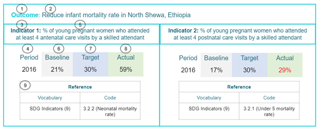
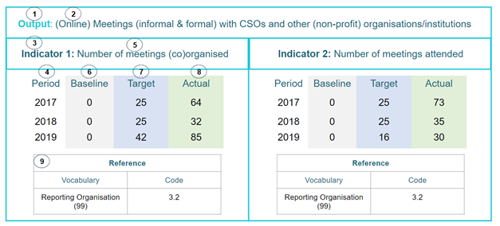

Understanding results data
==========================

There are many elements and attributes that can be used to describe an activity’s results. Results can contain several indicators. Each indicator will have a time period and may have

a baseline, target and actual value. These elements and attributes work together to build up detail of each result and the progress achieved. Further guidance can be found on the :doc:`Results information <results>` page.

Two detailed examples of how the guidance elements work together are below.

**Example 1**

A published activity contains one result. This result has the outcome of reducing infant mortality rates in North Shewa, Ethiopia. The progress towards this result is being measured by two indicators. One is to do with attendance at antenatal care visits, the other to do with postnatal care visits:

|image0|

**Example 2**

A `real activity published by Amref Health Kenya in Africa <http://www.d-portal.org/ctrack.html?reporting_ref=KE-NCB-93175#view=act&aid=KE-NGCB-93175-C234>`__. The result has an output of increasing meetings with CSOs and other institutions, and progress is measured by two indicators: the number of meetings organised, and the number of meetings attended. This result contains target and actual values for each year between 2017 and 2019. The reference code that has been added is from the publisher’s own internal vocabulary:

|image1|

The following list of features shows where the various facets of results data can be found in the above examples:

1. The type of result being reported

2. Title / description of the result

3. Indicators measuring the result

   -  Each result can have multiple indicators. Details can be added specifying the type of measure being used (unit, percentage etc.), whether the values are ascending or descending and whether or not the indicator is suitable for aggregation. Both examples contain two indicators.

4. Period start and end dates

   -  These are the periods of time in which indicators are being measured. A target and actual value can be published for each declared time period.

   -  The first example contains one period, covering the year 2016. The second example contains three periods, for years 2017, 2018 and 2019.

5. Title / description of the indicator

6. Baseline information

   -  Each indicator should have at least one baseline. Baselines must include the year in which the baseline was taken. Baselines can also include location and dimension elements; these allow for the disaggregation of results e.g. by gender, age or sex.

7. Target information

   -  Multiple targets can be added for each time period. The targets can contain different locations and dimensions which allow for disaggregation of results. Values must be provided for non-qualitative measures. Qualitative measures should not contain a value; rather details should be entered in the comment element.

8. Actual information

   -  Multiple actual values can be added for each time period. As with targets, actuals can contain different locations and dimensions which allow for disaggregation of results. Values must be provided for non-qualitative measures, qualitative measures should not contain a value but rather details should be entered in the comment element.

9. Reference to an external indicator or results framework

  -  The first example shows a reference linking the reported indicators to the Sustainable Development Goal Indicators. Guidance on how to report SDGs in IATI results can be found :doc:`here <sdg-guidance>`. The second example references the publisher’s internal results framework.

.. meta::
  :title: Understanding results data
  :description: Detailed examples of how IATI results data can be published and interpreted.
  :guidance_type: activity
  :date: July 27, 2020
